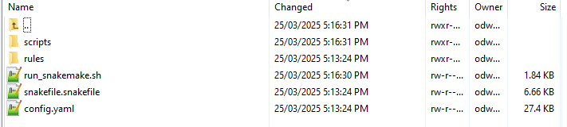
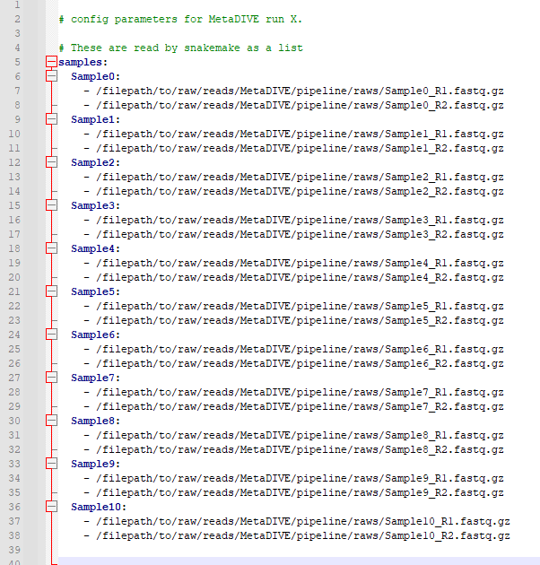
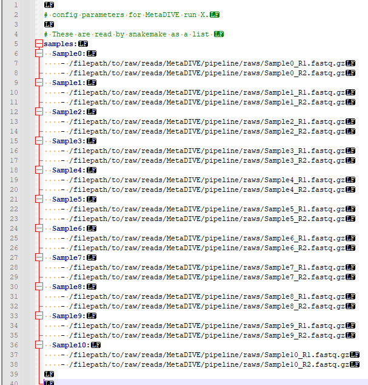
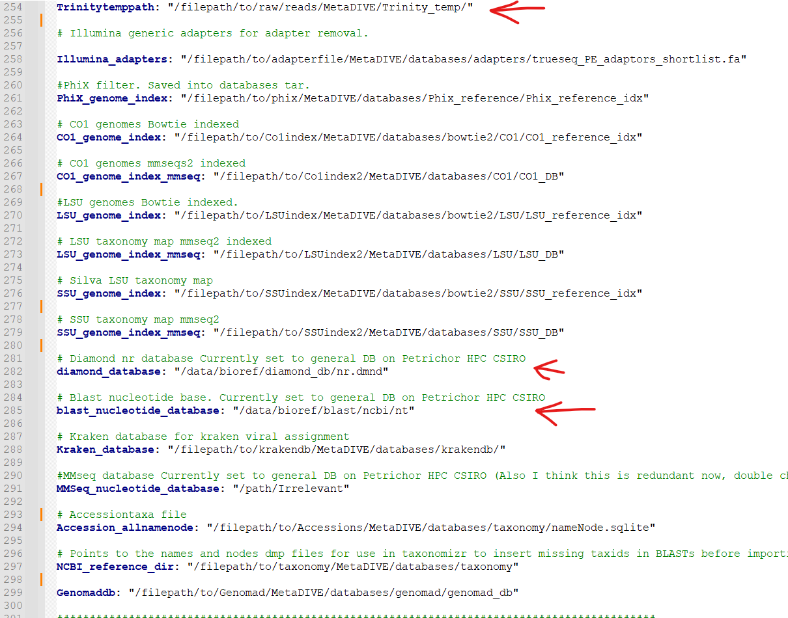

Run setup
=========

pipeline folder
---------------

To prepare for a MetaDIVE run we need to give the program some preferred settings for how to run and what analyses to perform. 

To begin we will change from the location of the MetaDIVE base directory into the **pipeline** directory:

.. code-block:: console

   $ cd pipeline

This folder has two main folders and three files of relevance here which are covered in greater detail in other sections

1. The folder **rules** contains the location of all rules files used to run MetaDIVE. The rules used are dependent on the parameters set for MetaDIVE and what modules are selected. For standard runs, no file in this folder needs to be changed but see :doc:`Rules files <Desc_rules>` for additional information on individual rules files.

2. The folder **scripts** contains the location of all scripts files used to run MetaDIVE. The scripts used are dependent on the parameters set for MetaDIVE and what modules are selected. For standard runs, no file in this folder needs to be changed

3. The file **run_snakemake.sh** is the master run script. We will be running this to start the analysis shortly.

4. The file **snakefile.snakefile** contains information about how MetaDIVE chooses which rules/scripts files to run. This file can be left alone indefinitely.

5. The file **config.yaml** is where all settings and parameters for running MetaDIVE are kept. We will go into detail on what each setting does below

config file
-----------

The **config.yaml** file is a text file which is read by MetaDIVE to determine what analyses to run and under what settings. The below will breakdown what every setting does and recommendations
for how to run each. For reading the text file it is recommended you use a program like notepad++ or something like a file viewer in Winscp but you can also view the file and make edits via command line
if you prefer.

Samples to run
~~~~~~~~~~~~~~

MetaDIVE reads sample names and sample paths as paired end data from the config.yaml file. As many samples as wanted can be added to a run (minimum 2 samples currently) but they need to follow 
a specific format to be read correctly. This format can be seen in the below two images (First, spacing characters hidden, second with spacing characters specified). 
But the general pattern is as shown.  
samples:

[space][space]SampleX:
[space][space][space][space]-[space]/filepath/sampleX_R1.fastq.gz
[space][space][space][space]-[space]/filepath/sampleX_R2.fastq.gz

[space][space]SampleY:
[space][space][space][space]-[space]/filepath/sampleY_R1.fastq.gz
[space][space][space][space]-[space]/filepath/sampleY_R2.fastq.gz

Populate this file with the names and paths to the samples you want to analyse.

Working program directory
~~~~~~~~~~~~~~~~~~~~~~~~~

At ~line 42 the working directory of where to run snakemake is given

e.g., 

.. code-block:: console

   program_dir: "/filepath/to/raw/reads/MetaDIVE/pipeline/"

This is automatically updated to the correct pathway when you run the installation scripts but if you copy and paste the snakemake analysis scripts for quick running a second analysis
this will need to be updated manually (See :ref:` <metadive-rerun>`)

Run memory requirements
~~~~~~~~~~~~~~~~~~~~~~~

Metagenomics pipelines can require **large amounts of memory** to run efficiently. This is because certain programs can require up to 100GB to run alone and whole pipelines often require
running multiple programs simultaneously 

To help optimise MetaDIVE, the pipeline uses a sensitivity setting to let the user specify how much memory they are able to give the pipeline.

The  Recommended memory ranges per settings are as described as below:
 **VHigh** = 180GB or more
 
 **High** = 130-180GB
  
 **Medium** = 90-130GB
 
 **Medium-Low** = 60-90GB

 **Low** = 40-60 GB  Note this pipeline currently has had limited testing at such low memory, large read datasets e.g., Nextseq/novaseq require far more memory than this to analyse. Many programs used in metagenomics require more than 40GB to run for just one sample. Running with so little may cause progams within the pipeline to crash

 **Ultra_low** = <40GB   Note this pipeline currently isn't tested at such low memory. Many individual programs used in metagenomics require more than 40GB to run for just one sample. Running with so little memory may cause programs within the pipeline to crash

Set the sensitivity to match the range of memory you are able to devote to the run 
e.g., on line ~56 of the config.yaml file write 'Medium' to tell MetaDIVE you will be allocating between 90-130GB of memory. 

.. code-block:: console

   Sensitivity: 'Medium'

You will then need to specify how much memory you want to run when you submit the **run_snakemake.sh** script (See :ref:` <metadive-runscript>` for how to prepare the run_snakemake.sh script)

Core module program specific settings
~~~~~~~~~~~~~~~~~~~~~~~~~~~~~~~~~~~~~

MetaDIVE utilises multiple programs to run its analysis. A number of key settings are made changeable in the config.yaml file. Here we will break them down 

Starting with Fastp filtering and trimming (~Lines 58-68 of the config file)
the following settings are given 

**minimum_length_filter_fastp** for the minimum read length a read has to reach to be included (reads smaller than this are filtered out)

**complexity_threshold** is the minimum read complexity of reads see Fastp documentation for specifics but in general, this setting filters out more redundant reads
(reads with excessive numbers of bases repeated e.g, AAAAAAAAAAAAAAAATTTTTTTTTTTTTTCCCCCCCCCCCCCGGGGGGGGGGGGGGG. A complexity filter of ~10 will remove most completely and near completely redundant
reads but if you are interested in viruses with rich repeat regions like herpesviruses a threshold of 5 may be more appropriate. 

**front_window_cutsize** is the size of the sliding window for minimum base quality. Together with **min_qual_window** this will trim the start and finish of the read to remove low quality sequence

**min_qual_filter** is the minimum single base quality filter. e.g., any base with a Phred score <16 will be filtered

**min_qual_filter_avg_read** is the minimum quality filter the whole read needs to pass to not be filtered.
 
Below is how each value should be written in the config.yaml file 

.. code-block:: console

   minimum_length_filter_fastp: 85
   
   complexity_threshold: 10
   
   front_window_cutsize: 4
   
   min_qual_filter: 16
   
   min_qual_filter_avg_read: 19
   
   min_qual_window: 20

**Next** is the choice of assembler to use (~ Line 78).

Trinity and Megahit are available as options to create contigs when running MetaDIVE. Each has advantages and negatives. If you have limited memory e.g., are running with the sensitivity of Medium-Low or lower.
it is recommended you use Megahit, however.

Write either 'Megahit' or 'Trinity'

.. code-block:: console

   Assembly_choice: 'Megahit'

The other setting of relevance for contig generation is minimum contig size (**Assembly_size**) (~line 100). This will instruct either program what the minimum size of contigs to return should be. Lower
values result in longer run times, and may have a slight increase in false positives if set too low. It is recommended to set above the size of your read pairs together. e.g., two 150bp reads
the minimum size should be at least 301.

.. code-block:: console

   Assembly_size: '301'

Two additional settings are available for **Trinity only** (lines 92-93). These are designed to assist with running Trinity more efficiently. As part of running, Trinity can create 
up to hundreds of thousands of small temporary files which can overload small-medium sized compute clusters. These settings allow the user to shift file creation to a temporary position in 
active memory. This requires your HPC system to be able to allow users to specify dedicated memory as a static/symbolic location and so may not work for all clusters. 
This setting will cause Trinity to use significantly more memory (5-50GB more per sample) but can decrease the run time of Trinity by up to 95%.
To run set the following settings. 

.. code-block:: console

   Use_memory_as_storage: 'yes'

(the "Memory_directory_location" is the path to your linked memory where you will be 'storing' the files instead of writing them to disk)

.. code-block:: console

   Memory_directory_location: $MEMDIR

**Next** is the choice of how to run **Diamond blastx**
This setting strongly influences how long the entire pipeline takes as the highest sensitivity levels can result in the single Diamond contig blastx 
taking the same length as all other steps in the pipeline combined. 

Based on the approximations from the Diamond manual page. 

fast= >90% amino acid identity hits

mid-sensitive is partway between fast and sensitive e.g., ~65%.

sensitive is for >40% amino acid sensitivity

more-sensitive is the same as sensitive but with no masking so repeat sequences are better captured 

very-sensitive is for sequences <40% amino acid sensitivity

ultra-sensitive is more sensitive than very-sensitive. 

If you are in a rush and after only known, pathogenic viruses, fast is sufficient. 
If you are working with species where fewer viruses are classified but it is likely you are looking at viruses from a genus that is known I would recommend mid-sensitive 
If you are looking to detect very divergent viruses from either poorly classified genera/families, or unclassified viruses I would recommend sensitive. 
For anything more diverged, I would recommend running geNomad module as well as this has a lower false positive chance and is more efficient/faster than very-sensitive Diamond blastx 
while having the advantage of picking up far more novel viruses. 

options for this setting are:

**'fast'** **'mid-sensitive'**, **'sensitive'**, **'more-sensitive'**, **'very-sensitive'**, **'ultra-sensitive'**

.. code-block:: console

   Diamond_sensitivity_setting: 'mid-sensitive'

**Next** is a setting to describe how to generate final results for contig assignments. This setting allows you to pick whether BLASTn is run on viral contigs identified through BLASTx. This
has two benefits, first it allows for a reduction in accidental false assignments, and second in scenarios where there are few references of a virus on NCBI for a virus detected, the secondary BLASTn step can result it 
fewer strains/similar species being assigned and a closer overal matching species found. This setting is strongly recommended
Options for this setting are **'yes/no'**

.. code-block:: console

   Blastn_viral_contig_false_positive_check: 'yes'

**Next** there is the setting "Final_contigs_returned". This lets you choose whether Dimond BLASTx matches to all viruses should be returned or contigs which were identified as not viruses by BLASTn should be removed from the
virus lists. If set to 'confirmed' this will also update the assignments of virus species to be that of the BLASTn results and not the BLASTx. 
It is recommended to have this setting set to 'confirmed' for most cases but in very rare cases when searching for specific phages or endogenous viruses it may be better to have set to 'all'
Options are **'all/confirmed'**

.. code-block:: console

   Final_contigs_returned: 'confirmed'

**Next** as many modules in MetaDIVE utilise NCBI datasets and are updated in realtime an NCBI_API_KEY is recommended to speed up downloads (you can generate an API key just for having a free NIH account)
If you have a key, add it here, if not, write 'none'

.. code-block:: console

   NCBI_API_KEY: 'none'

**Lastly**, MetaDIVE generates a lot of intermediary files when running analyses. These can be kept or can be deleted when the final summary files are being generated. 
A setting has been provided to delete all other files if you want. 
Options are **'yes/no'**

.. code-block:: console

   Delete_inter_files: "no"

Module settings
~~~~~~~~~~~~~~~

MetaDIVE has many modular components that are optional and help focus the pipeline on specific research goals (See :doc:`the MetaDIVE overview for a referesher of the pipeline structure <Overview>` )

Here we will detail how to activate/deactivate specific modules and in the case of some modules change some settings to allow for better customisation of the pipeline to specific tasks.  (Note, while testing has been done on most common
combinations of modules, there are up to 5000 possible combinations of the pipeline and so if a specific module pairing doesn't work please create an issue tag so it can be investigated)

Host detection and filtering plus microbiome analysis
^^^^^^^^^^^^^^^^^^^^^^^^^^^^^^^^^^^^^^^^^^^^^^^^^^^^^

The host detection and microbiome modules run in tandem with the host detection requiring the part of the results of the microbiome analyses but the specifics of both can be adjusted for speed.  

The inspecthost setting will tell MetaDIVE whether or not you want to try to identify the host animal species of the dataset. In scenarios where there are multiple spp, it will identify the most abundant
it has the values **'yes'/'no'**

.. code-block:: console

   inspecthost: 'yes'

The Host_filter setting will tell MetaDIVE whether or not you want to remove all reads identified as host (this will greatly speed up the MetaDIVE pipeline, and may in some cases also decrease false positive assignments)
it has the values **'yes'/'no'**

.. code-block:: console

   Host_filter: 'yes'

The Microbiome_classification setting will tell MetaDIVE whether or not you want to generate microbiome classifications using CO1 and rRNA reads found in each sample.
it has the values **'yes'/'no'**

.. code-block:: console

   Microbiome_classification: 'yes'

As the host species is identified via CO1, LSU and SSU similarities some markers may be more informative than others. If you think you know roughly what type of host organism is present, e.g., mammal vs insect vs bird you can up or down
scale the weighted score for each marker used to identify the likely host species. e.g., in the below example. CO1 gene is 3 times more important than LSU and 1.5 times more important than SSU

.. code-block:: console

   CO1weight: 3
   LSUweight: 1
   SSUweight: 2

Assign unclassified contigs using BLASTn 
^^^^^^^^^^^^^^^^^^^^^^^^^^^^^^^^^^^^^^^^

For contigs that were not assigned to any species using Diamond BlastX you can attempt assignment using BLASTn. This is very slow and can take longer than every other step of the pipeline combined. I recommend only running this
on very small datasets.

.. code-block:: console

   DNA_assign_blastn: 'no'

Adaptive Viral Reference Mapping 
^^^^^^^^^^^^^^^^^^^^^^^^^^^^^^^^

This module allows for the a reference assembled viral genome to be assembled. This module will download multiple reference genomes of any viruses detected in MetaDIVE and align all unassembled reads directly to the references to identify the
closest matchnig reference and generate a reference guided assembly helping fill small gaps in the viral genome that may have been missed using standard de-novo assembly methods. This module works best for viruses in your sample that are >85% 
similar to at least one complete reference genome. This setting is limiated in functionality when segmented viruses are investigated. 
Options are **'yes/no'**

.. code-block:: console

   Viral_genome_build: 'no'

Adaptive Viral Tree Building 
^^^^^^^^^^^^^^^^^^^^^^^^^^^^

This module will use the assembled genomes from the Adaptive Viral reference mapping module as well as the identified reference species already downloaded to generate nucleotide sequence alignments and phylogenetic trees of each genome
to get a quick idea of how diverged the identified virus is from other known references of that species.
Options are **'yes/no'**

.. code-block:: console

   Viral_genome_tree_building: 'no'

Adaptive Viral Contig Clustering
^^^^^^^^^^^^^^^^^^^^^^^^^^^^^^^^

This module will use geNomad to attempt to identify more diverged viruses (<40% AA similarity) as well as cluster contigs together which may be from the same diverged species despite assigning to different reference species e.g., low identity 
matches to two separate parvo viruses when your sample has a third different species of the virus with no reference genome available in NCBI.

Options are **'yes/no'**

.. code-block:: console

   Genomad_detect: 'no'

Single Reads Analysis
^^^^^^^^^^^^^^^^^^^^^

This module will allow for the classification of single reads which didn't form larger contigs. This setting can greatly improve the number of viruses detected when viral concentration is expected to be very low in the sample. 
It will greatly increase the time it takes for MetaDIVE to run, however. There are two settings that need to be set to yes to run this module both with yes/no options
Options are **'yes/no'**

.. code-block:: console

   run_raws: 'yes'
   dodiamond_blast_raws: 'yes'

The single reads analysis uses both kraken and Diamond BLASTx and the number of viral reads returned from both can be set to reduce how long the single reads analysis takes. We recommend that the number of kraken reads stays below the total 
number of reads. We also recommend that Raw_reads_max is <50000. The majority of time spent running this module is spent confirming the identified viral reads through BLASTn after Diamond BLASTx/Kraken2 identification.

.. code-block:: console

   Raw_reads_max_kraken: 10000
   Raw_reads_max: 20000

One way to greatly speed up this module is to restrict the Diamond database to only include viruses. This requires the Diamond database to have been built with taxonomic information. If the Diamond database has not been built with
taxIDs assigned to sequences set this setting to 'no' 
Options are **'yes/no'**

.. code-block:: console

   Diamondrawviralfiltonly: 'yes'

For the Single Reads Analysis, there is also an option to set a threshold for how many reads are required before a virus is reported in summary tables and figures. 

This is recommended to be between 3 and 50 depending on the purpose of the analysis. 

.. code-block:: console

   readcountthresh: 3

Diverged read/contig detection
^^^^^^^^^^^^^^^^^^^^^^^^^^^^^^

Single read analysis is limited to detecting sequences that are at least 85% similar to a known virus. The diverged read/contig detection module allows for the detection of reads as diverged as 30-50% from viral references with a relatively small
increase in run time. This module requires at least 1 contig or 3 reads to be assigned to a virus before diverged read detection occurs.
**This setting also requires that Diamondrawviralfiltonly is set to 'yes'**
Options are **'yes/no'**

.. code-block:: console

   Divergent_reads_and_contigs_search: 'yes'

The Diverged read/contig detection will detected more diverged reads based on the Diamond BLASTx settings provided here.

We recommend you use anything as sensitive or more sensitive.
Options are **'fast'**, **'mid-sensitive'**, **'sensitive'**, **'more-sensitive'**, **'very-sensitive'**, **'ultra-sensitive'**

.. code-block:: console

   Divergent_reads_and_contigs_sensitivity: 'ultra-sensitive'

Database paths 
~~~~~~~~~~~~~~

Almost all databases in MetaDIVE are updated automatically. There are 3 exceptions that you will need to update manually. 

The **Trinitytemppath:** setting needs to point to where you would like Trinity files to be generated. This pathway has to be an existing folder. This is automatically set to the MetaDIVE folder but you may want to set it somewhere else 
which is capable of storing all the temporary files Trinity needs

The **diamond_database:** needs to point to where your Diamond database is located on your HPC system 

The **blast_nucleotide_database:** needs to point to where your Blastn database is located on your HPC system. 

.. _metadive-runscript:

Running MetaDIVE
----------------

Once you have updated settings to what you would like you are ready to run the analysis.

To do this first open the file in the pipeline directory titled

**run_snakemake.sh** 

and change the number of CPUs, memory and time you want to allocate to the analysis. These resources will then be divided by MetaDIVE to allow for the parallel running of multiple samples. The exact labels that need to be changed here 
are dependent on what HPC system you have but for a SLURM system the settings to change are 

#SBATCH --cpus-per-task 48               # total number of CPUs to allocate. depending on size of data and urgency, 12-48

#SBATCH --mem 100G                       # Total memory. Can require a lot particularly if you want to run trinity! between 80 and 180 depending on complexity of data

#SBATCH --time 48:00:00                 # Time requirements hh/mm/ss would recommend around 100 hours for large datasets. If it doesn't complete you can always run the run_snakemake.sh script again and it will pick up where it last left off.

once these settings are updated save the file and now you can run the file with your HPC batch system. 

e.g.,  if you are in the MetaDIVE folder and have a slurm system you can run, but if you are in the pipeline folder already you can just run sbatch run_snakemake.sh

.. code-block:: console

   cd pipeline/
   sbatch run_snakemake.sh

.. _metadive-rerun:

Rerunning MetaDIVE/running on new datasets
------------------------------------------

Running MetaDIVE on multiple datasets is very easy. Once it has been run once, all databases are set up and subsequent runs will be much simpler. 

To run a second or more time the easiest way to do this is to copy the following files and folders in the **pipeline** folder from your earlier run and paste them into a new folder

1. The folder **rules** 

2. The folder **scripts**

3. The file **run_snakemake.sh** 

4. The file **snakefile.snakefile**

5. The file **config.yaml**

Then open the config.yaml file and update the **samples** and the **program_dir:** to your new samples and folder path. 

After that you can change any settings you think would be better for this new dataset and run the pipeline by running run_snakemake.sh