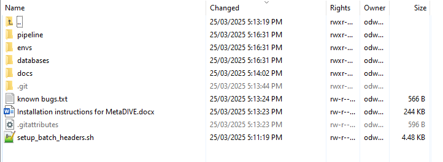

Installation guide
==================

Conda Installation
------------------

To use MetaDIVE, first install conda which is the software management system used:

To do this we need to pick a location to install miniconda and then download and unpack the program

**First** we create a directory somewhere that can store large numbers of files (~10,000-50,000):

.. code-block:: console

   $ mkdir /path/to/desired/directory/miniconda

**Next** we download the latest version of miniconda:

.. code-block:: console

   $ wget https://repo.anaconda.com/miniconda/Miniconda3-latest-Linux-x86_64.sh -O /path/to/desired/directory/miniconda/miniconda.sh

**Then** we unpack the download and install:

.. code-block:: console

   $ bash /path/to/desired/directory/miniconda/miniconda.sh -b -u -p /path/to/desired/directory/miniconda/

**Then** we activate the conda environment:

.. code-block:: console

   $ /path/to/desired/directory/miniconda/bin/conda init bash

**Finally** we close down the terminal and reopen the terminal so that the conda environment is ready.:

.. code-block:: console

   $ exit

Downloading MetaDIVE
--------------------

(If conda is already installed you can skip to here)

Now that conda is available we need to **download gitlfs** to download MetaDIVE correctly

To do that we just use our new conda environment:

.. code-block:: console

   $ conda install conda-forge::git-lfs -y

This will automatically install gitlfs through conda into your base conda environment
after it is finished downloading we need to activate gitlfs:

.. code-block:: console

   $ git lfs install

After installing and activating gitlfs we can download MetaDIVE. Create a folder where you would like to run the analysis. 

The folder you download MetaDIVE into is where the analysis will take place. MetaDIVE will download into this folder as a subfolder called MetaDIVE: 

.. code-block:: console

   $ mkdir /path/to/where/you/want/to/run
   $ cd /path/to/where/you/want/to/run
   $ git clone https://github.com/James-ODwyer/MetaDIVE.git

After you are finished copying MetaDIVE the folder structure will look like the following:

Note: the main folders in MetaDIVE are as follows

1. **databases** which contains the location of where almost all databases MetaDIVE needs are. See :ref:` <metadive-databases>` for additional information on installing databases.

2. **envs** which contains the location of the names of all software to be installed for MetaDIVE to run. See :ref:` <metadive-environments>` for additional information on installing databases.

3. **pipeline** which contains the analysis scripts and rules for how MetaDIVE runs as well as the config file for changing metaDIVE settings. This is also where MetaDIVE will run and save outputs to.

Building MetaDIVE scripts 
-------------------------

MetaDIVE is made to work on bash HPC systems but there are a lot of different variables for how your HPC system may run.

The biggest is how your system batches and organises job submissions,

but there are also other aspects like whether your HPC lets you access the internet from a cluster, what partitions are used and even if an account code is required.

There are too many possibilities to cover them all here but MetaDIVE will attempt to update all scripts used to reflect your system with the below script located in the first folder of
the downloaded MetaDIVE git using "setup_bash_scripts.sh". This file can be seen in the above image if you are unsure of where it is in the MetaDIVE folder.

The variables to know are batch-system where you specify what batch system your HPC uses "PBS|SLURM|QSUB|LSF|SGE|CUSTOM".

partition where you specify how your HPC partitions their compute resources "Any_value" e.g., "long|short|compute|data|".

download_partition where if a specific partition is required to access the internet and download objects give it here (this pipeline downloads host genomes dynamically from NCBI) "download|io|any_other_value".

account where if you are required to give an account/project name to submitted job scripts "labxyz|projectxyz|useridxyz|etc":

.. code-block:: console

   $ cd MetaDIVE
   $ bash setup_batch_headers.sh \
      --batch-system SLURM \
      --partition compute \
      --download_partition io \
      --account my_lab

.. _metadive-environments:

MetaDIVE environments 
---------------------

All software required to run MetaDIVE is kept in conda environments but before MetaDIVE is run for the first time this software needs to be installed.

To do this all that is required is to run **Create_conda_environments.sh** located in the envs directory (MetaDIVE/envs).

This script will download all required software and install the correct conda environments for later use.

The script will take ~ 15 minutes to run but will only need to be done once regardless of how many times MetaDIVE is run.

Assuming you are in the MetaDive directory run the following script: 

.. code-block:: console

   $ sbatch ./envs/Create_conda_environments.sh

.. _metadive-databases:

MetaDIVE databases
------------------

MetaDIVE uses multiple databases, the majority of which are either unpacked from the zip files or are downloaded and built directly.

Two databases are assumed to be present on your HPC system already and are not downloaded and built as part of MetaDIVE, these are the Diamond dmnd and Blast nt databases.

These are often very large and it is recommended to use a single centrally located copy instead of installing multiple copies for every user.

To create all other databases all that is needed to do is run **download_and_build_databases.sh** located in the databases directory (MetaDIVE/databases)

The script will take ~ 90-120 minutes to run but will only need to be done once regardless of how many times MetaDIVE is run.

Assuming you are in the MetaDIVE directory run the following script: 

.. code-block:: console

   $ sbatch ./databases/download_and_build_databases.sh

After running this MetaDIVE is fully installed and can be run indefinitely.

Once completed you can move to setting up your MetaDIVE run. 

:doc:`Next: Choosing Parameters <Run_setup>`
