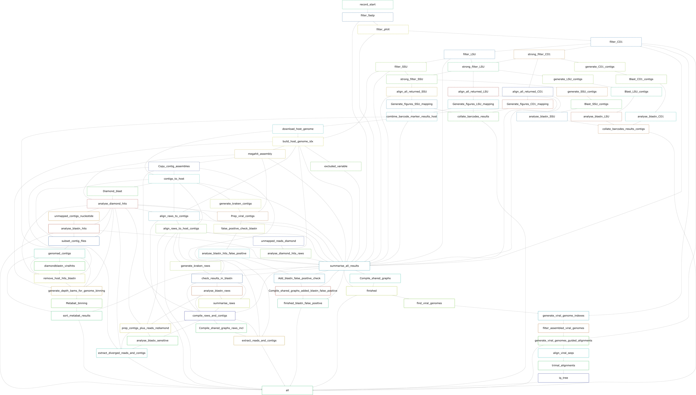

MetaDIVE Overview
=================

**MetaDIVE** is a metagenomics analysis pipeline which specialises in the high accuracy and low false negative detection.
of both **known** and highly **novel** viruses. 

For a description of the pipelines performance see (Reference here for paper).

MetaDIVE is designed to assist with viral identification in a variety of circumstances ranging from broad viral discovery to scenarios where high precision and low false positive assignments are required. 
To achieve this goal, MetaDIVE utilises multiple checks to decrease the likelihood of any viruses being incorrectly assigned or missed. MetaDIVE is highly accurate for all virus types excluding phages where it is 
limited based on the potential of accidental phage embedding in the diversity of bacterial genomes sequenced as references already. 

The ethos of MetaDIVE is to provide the user with clear and concise findings first and foremost but to also complement every finding with a way for the user to manually inspect the results so that confidence and certainty
can be achieved. To help with this, MetaDIVE reports on many additional statistics which can help inform on assignment accuracy and provides reads/contigs as sorted results files to their assigned species for easy manual inspection.

The goal of accurate metagenomic analysis of both known and novel viruses is a complex one however, and as such to help users only investigate the analyses most relevant to their research
MetaDIVE has been structured with a **modular design** where certain analysis can be turned on or off depending on the goal, the speed required, and the dataset type. 

Below are two examples of the MetaDIVE workflow. The first image shows the workflow of MetaDIVE with every module activated

The second, shows MetaDIVE with the core module activated. 

As can be seen in the above figures, almost all of the analyses MetaDIVE can perform are optional allowing for great versatility and flexability of the pipeline. 

Here we will document each module specifically and provide a summary usecase to assist with whether the module is best for the user. 
Note: MetaDIVE uses a wide range of software to run. A full list of software and relevant citations can be found in :doc:`References <References>`

**Core Module (Module 1): Data filtering, assembly, and viral classification**
------------------------------------------------------------------------------

Components
~~~~~~~~~~

The core module performs:
**Data preprocessing:** fastp (Chen et al., 2018) for adaptor and quality trimming, Bowtie2 (Langmead & Salzberg, 2012) for depletion of phiX, cytochrome oxidase I (CO1), and ribosomal RNA (rRNA).

**Contig assembly:** Trinity (Grabherr et al., 2011) or Megahit (D. Li et al., 2015).

**Viral classification:** Kraken2 (Wood et al., 2019), DIAMOND BLASTx (Buchfink et al., 2021), and confirmatory BLASTn using BLAST+ (Camacho et al., 2009).

**Taxonomic classification:** TaxonKit (Shen & Ren, 2021) and TaxonomizeR (Sherrill-Mix, 2020).

Results produced:
~~~~~~~~~~~~~~~~~

This module will produce a variety of different summary graphs and tables describing the overall run quality as well as the proportion of reads assigned to different groups of organisms

Key results include

1. Graph/table of assignment of all reads from QC failed to taxa group assignments

2. Detailed tables/figures of top assigned Viruses/Bacteria/Eukaryotes and the BLAST results for how well each spp was assigned.

3. Assembled contigs file per sample (Megahit/Trinity results)

Use cases:
~~~~~~~~~~

This module is relatively fast to run and provides an accurate assessment of what viruses are present/absent in each sample. It also provides insights into the composition of reads for each sample
e.g., if the sample was majority rRNA or poor quality reads etc. This module lacks some more in depth analyses and does not collate results contigs/reads by species for manual inspection. It is 
best used for a quick but comprehensive understanding of what viruses are in a sample. 

**Module 2: Microbiome Classification**
---------------------------------------

Components
~~~~~~~~~~

The identified rRNA and CO1 reads undergo stringent filtering with Bowtie2, last common ancestor analysis with MMseqs2 (Steinegger & Soding, 2017), assembly of rRNA contigs with Megahit, and BLASTn for species inference.

Results produced:
~~~~~~~~~~~~~~~~~

This module will produce a number of more comprehensive results specifically analysing the rRNA and CO1 regions of organisms in the sample. This allows for a more in depth and accurate analysis
of bacterial communities and Eukaryote spp. 

Key results include:

1. LCA graphs of read assignments to all species for the CO1 region, LSU regions and SSU regions.

2. Assembled contigs of the CO1 region, LSU regions and SSU regions and BLASTn results for their taxonomic assignments resulting in partial or complete regions for high abundance species.

Use cases:
~~~~~~~~~~

This module is very fast and helps complement the bacterial and Eukaryote based limitations of other modules. As other modules are BLASTx first, they are prone to false positives and negatives in Bacterial/Eukaryote
assignment in non coding regions. This module allows for more reliable assignments of the most abundant non viral species present with very low false positive rates due to assembling larger contigs of marker genes. Use this
module if you are after some additional information on non viral spp. but don't need to assemble significant portions of bacterial/Eukaryote genomes.

**Module 3: Dynamic Host Identification and Depletion**
-------------------------------------------------------

Components
~~~~~~~~~~

Host species identification is performed using CO1 and rRNA reads, with the best matching whole genome downloaded via Entrez Direct (Kans, 2024). Reads are then aligned and depleted against the host genome using Bowtie2.

Results produced:
~~~~~~~~~~~~~~~~~

This module will allow for final read assignments to include a specific host species section allowing for a better understanding of the distribution of reads. 
This module also greatly speeds up analysis by removing host reads prior to assembly and taxonomic assignments and can reduce the chance of false positive assignments through endogenous elements. 

Use cases:
~~~~~~~~~~

This module is useful in nearly all cases purely for its ability to speed up all downstream analyses at no cost to accuracy. In some rare cases it may cause endogenous viruses to be filtered out
e.g., FeLV but this typically only occurs when the virus is at ultra low abundance (a handful of reads total) and is rare even in those circumstances. 

**Module 4: Single Reads Analysis**
-----------------------------------

Components
~~~~~~~~~~

For reads not forming contigs, less stringent DIAMOND BLASTx and Kraken2 analyses are conducted. Viral-positive reads are clustered with CD-HIT (Fu et al., 2012), and representative reads are analysed with BLASTn.

Results produced:
~~~~~~~~~~~~~~~~~

This module produces several additional results summary files as well as a more detailed sample specific breakdown of results and subsets all reads to species specific folders allowing for manual inspection

Key results include:

1. Expanded summary results tables to include single reads in final read counts

2. interactive html tables/csv file showing read assignments, read complexity metrics and identity scores of matches of contigs/reads to each virus identified.

3. Individual folders per viral spp identified which contain all reads and contigs assigned to each virus for quick manual inspection

Use cases:
~~~~~~~~~~

This module is useful for any situation where multiple viral species are expected (not sequencing specific viral isolates). It helps assign more reads to every virus helping build up generated viral genomes
and can identify ultra low abundant viruses (those which are so low abundance they don't form contigs). 

**Module 5: Diverged read/contig detection**
--------------------------------------------

Components
~~~~~~~~~~

All previously detected species within the pipeline with identities <95% to a reference genome are used to subset a DIAMOND database by species for rapid detection of ultra diverged reads and contigs through utilising the most sensitive detection settings in DIAMOND BLASTx (requires Diamond database to be built with TaxID information). 

Results produced:
~~~~~~~~~~~~~~~~~

This module builds on Module 4 and specifically targets more diverged viruses. It detects all reads to viruses which were too diverged to be detected by Module 4. 

Key results include:

1. csv file showing read assignments, read complexity metrics and identity scores of matches of contigs/reads to each virus identified updated to include additional diverged reads found.

2. additional reads and contigs added to each viral spp folder generated in Module 4. 

Use cases:
~~~~~~~~~~

This module is most useful when novel viral species are present in relatively low abundance (the whole genome isn't assembled). When the user is investigating understudied metagenomic samples e.g., environmental samples, 
viromes of understudied eukaryotes, this module will provide additional useful information at only small increases to run time and compute resources.  

**Module 6: Adaptive Viral Reference Mapping**
----------------------------------------------

Components
~~~~~~~~~~

For viruses with sufficient reads and high pairwise similarity, up to 100 viral genomes are downloaded. Reads are mapped to these genomes using Bowtie2 for reference-guided assembly and high-accuracy De-novo assembly using SPAdes (Bankevich et al., 2012) is performed.

Results produced:
~~~~~~~~~~~~~~~~~

This module produces additional reference guided and targetted de-novo assemblies of specific viral spp. 

Key results include:

1. Reference guided genome consensus of higher abundance viruses

2. Direct mapping of idividual reads to targeted species reducing potential contamination and in some cases resulting in higher read assignments

3. Generation of de-novo assembly of reads mapping to individual viruses

Use cases:
~~~~~~~~~~

This module is useful for when the target viral sp/spp being investigated are known species with good references on NCBI. The generation of a local aligned consensus genome and de-novo assembly
allow for quick manual comparison to look for the presence of moderately sized indels in a genome and can help speed the process of high quality genome assembly up significantly.  

Module 7: Adaptive Viral Tree Building
--------------------------------------

Components
~~~~~~~~~~

De novo and reference-guided assemblies are aligned with downloaded viral genomes using MAFFT (Katoh et al., 2002), trimmed with trimAl (Capella-Gutierrez et al., 2009), and analysed with IQ-TREE (Nguyen et al., 2015) to generate phylogenetic trees.

Results produced:
~~~~~~~~~~~~~~~~~

This module produces additional results from the Module 6 results. This module produces a quick phylogenetic tree of each viral spp which includes references of the viral species and both the reference guided consensus and the 
de-novo assembly.

Use cases:
~~~~~~~~~~

This module is useful to gain a quick understanding of what the phylogeny of the virus detected is (although this is a fast and preliminary estimate and it is recommended that a second analysis 
is run manually with paramaters and references specific to the viral spp and research goal).

**Module 8: Adaptive Viral Contig Clustering**
----------------------------------------------

Components
~~~~~~~~~~

Divergent/fragmented viruses are identified using geNomad (Camargo et al., 2024) and clustered into genomes with MetaBAT2 (Kang et al., 2019).

Results produced:
~~~~~~~~~~~~~~~~~

This module can produce additional results which first can identify highly novel viral contigs, and second cluster these contigs together as the same novel species regardless of whether a close enough reference
exists for the novel species on NCBI. 

Key results include:

1. New folder of MetaBat binned contigs sorted by species

Use cases:
~~~~~~~~~~

This module is useful for when the user is interested in ultra diverged viral spp at the <40% Amino acid similarity to any existing reference. It requires relatively good coverage of the viruses to bin and so is not effective for ultra low abundance viruses.
It can also assist with clustering contigs from moderately diverged species where some contigs may assign directly to different species but are actually a single diverged species. 

